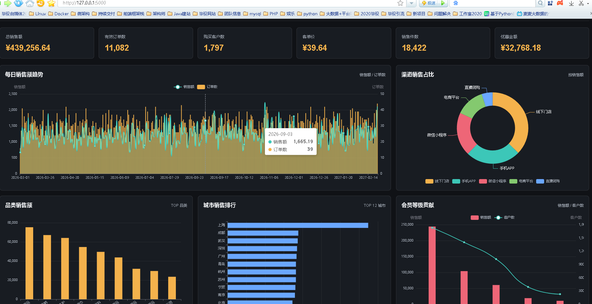
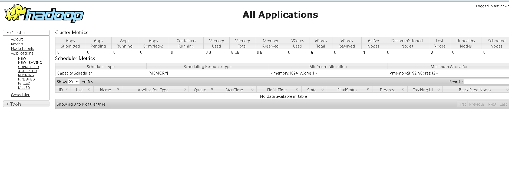
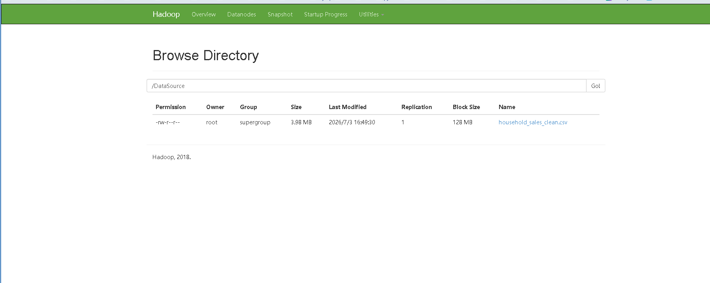
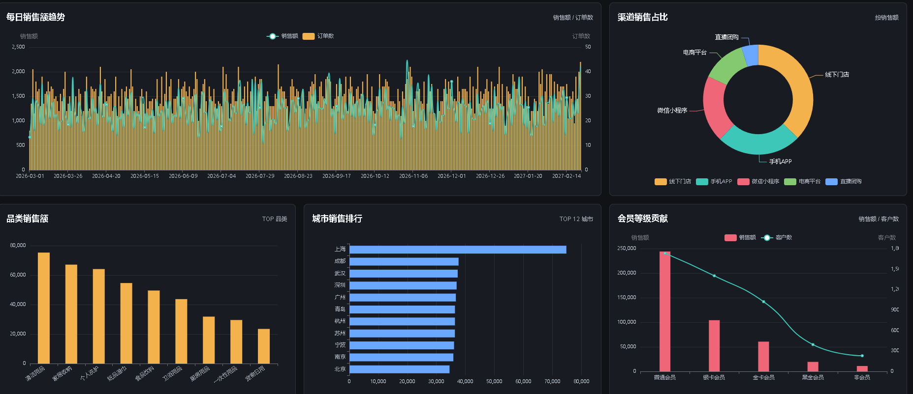
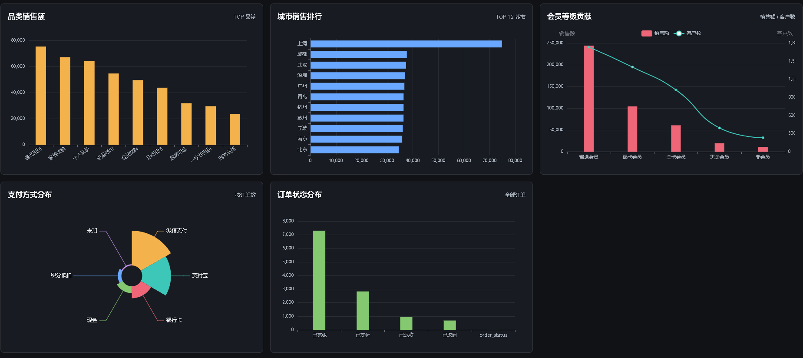
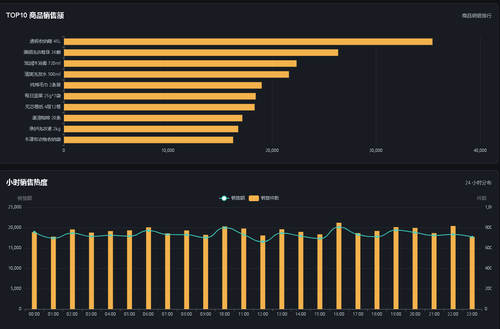
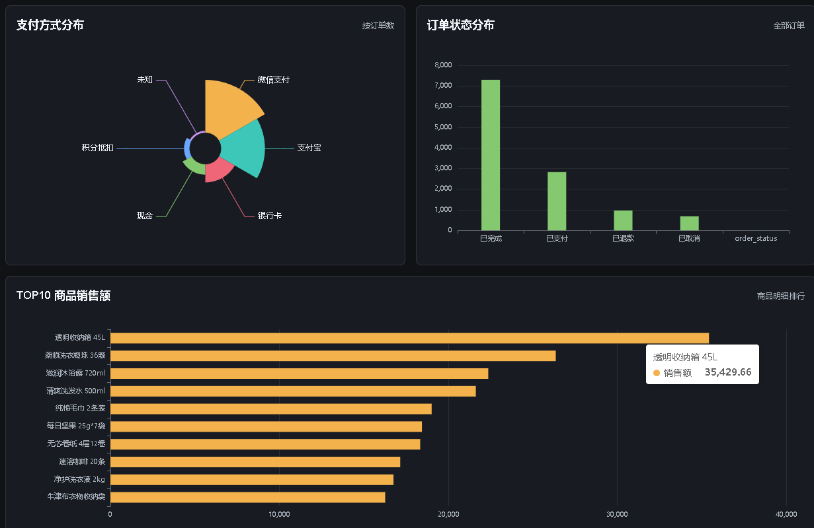

## 计算机毕业设计hadoop+spark+hive电商数据分析可视化 生活用品销售数据分析 大数据毕业设计(源码+LW+PPT+讲解)

## 要求
### 源码有偿！一套(论文 PPT 源码+sql脚本+教程)

### 
### 加好友前帮忙start一下，并备注github有偿电商数据分析
### 我的QQ号是2827724252或者微信:code520888 或者 bysj2023nb

# 

### 加qq好友说明（被部分 网友整得心力交瘁）：
    1.加好友务必按照格式备注
    2.避免浪费各自的时间！
    3.当“客服”不容易，repo 主是体面人，不爆粗，性格好，文明人。

## 开发技术：
前端：vue.js、echarts
后端：SpringBoot、MyBatis
数据库：MySQL Hive数据仓库
实时计算：SparkStreaming、Kafka
离线计算：SparkCore SparkSQL
数据集存放位置：HDFS

## 运行视频
https://www.bilibili.com/video/BV1JFTt6aEvk

## 运行截图

